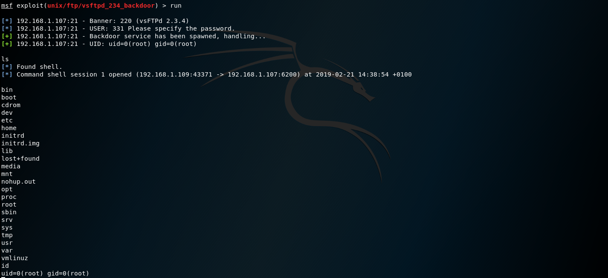

# TP Sécurité - Audit et pentest
Membres du groupe:
* Charhazed Yousfi
* Jean-Pierre Bachmann
* Alexandre Tricaud
* Louis Charlier
* Marin Vilorgeux
* Raphaël Bova
* Lucas Février
* Clément Ruiz

## Audit - Metasploit (Linux)
### Présentation

Metasploit est une suite d'outils permettant d'automatiser différents types d'attaques. `Metasploitable` est une distribution linux où un grand nombre de vulnérabilités ont été volontairement introduites dans le but de permettre à des étudiants de se former sur les différentes attaques et moyens de s'en défendre.

Dans notre cas, la machine `metasploitable` est accessible à l'adresse `192.168.1.107`.

### Démarche
* On lance un nmap pour repérer les services en écoute :

* On repère que les services Telnet et FTP, entre autres, sont en écoute

### Failles et Exploits
#### Telnet
* On tente de se connecter en Telnet sur `192.168.1.107:23`
* Les identifiants par défaut de `metasploitable` nous sont gentiment affichés. On se connecte avec ces credentials.
* On regade si l'utilisateur a des droits `sudo`, et on remarque qu'il peut passer n'importe quelle commande sous l'identité de `root`.
* On prend l'identité de root grâce à la commande `su`
Screen shot :

#### VSFTPD
`VSFTPD` est un serveur FTP utilisant le port 21. La version disponible sur la distribution `metasploitable` comporte une backdoor directement dans le code source. En effet, celle-ci permet une connexion à partir du moment où le login finit la chaîne `:)` (un smiley).
Cette fonctionnalité est documentée sur le site de Metasploit :

> On port 21, Metasploitable2 runs vsftpd, a popular FTP server. This particular version contains a backdoor that was slipped into the source code by an unknown intruder. The backdoor was quickly identified and removed, but not before quite a few people downloaded it. If a username is sent that ends in the sequence :) [ a happy face ], the backdoored version will open a listening shell on port 6200. We can demonstrate this with telnet or use the Metasploit Framework module to automatically exploit it.

On utilise un plugin metasploit pour exploiter cette vulnérabilité :

## Audit - Windows (XP)
Pour mener à bien les attaques sur cette machine Windows XP, on utilise le framework `metasploit` avec quelques plugins adaptés :

Cependant, aucune de nos tentatives n'a été fructueuse.

## Audit - Web service (HTTP 1.1)
### Challenge
> Quel merveilleux métier pourriez-vous exercer à l'issue de votre cursus ingésup ? (Indice: bestial)

### Périmètre
* Serveur web disponible à `192.168.1.1`
* `www.ynov.com`
* `extranet.ynov.com` (nécessite authentification)

### Découverte
Notre cible est un serveur web, on essaye donc de s'y rendre, et nous retrouvons face à :
* une redirection systématique vers une connexion HTTPS
* une authentification basique.

On regarde si d'autres services écoutent sur ce serveur à l'aide de `nmap`

On remarque que le port 22 est ouvert, on peut donc tenter de "bruteforce" le mot de passe d'un utilisateur avec des outils appropriés comme `hydra`

### SSH & `hydra`
`hydra` est un outil de bruteforce par dictionnaire, nottament à distance au travers de différents protocoles (ici SSH).
On teste d'abord avec le nom de la société en user, soit : `ynov`

On a donc trouvé le couple identifiant / mot de passe d'un utilisateur système : `ynov` / `123456`
On les utilise pour ouvrir une session SSH.

### HTTPS et `openssl`

Une fois l'accès SSH obtenu, on peut faire quelques recherches sur la version du serveur web (`apache2`) et de la librairie de chiffrement utilisée (`openssl`)

Après quelques recherches, cette version est répertoriée comme vulnérable à la faille "HeartBleed", et peut être exploitée à l'aide d'un pluggin `metasploit`. Cette faille implique des corruptions de la mémoire permettant de récupérer le contenu de la RAM, afin d'y trouver des informations intéressantes.
On lance donc l'attaque avec `metasploit`

Sur le screenshot précédent, on voit un header d'autorisation HTTP avec une valeur en base 64. Une fois décodé, on trouve la valeur suivante :

On utilise ce couple identifiant mot de passe pour passer l'authentification basique du site HTTP.
On arrive vers un réplicat du site YNOV, dans lequel, en fouillant un peu, on tombe sur la réponse au challenge posé :

